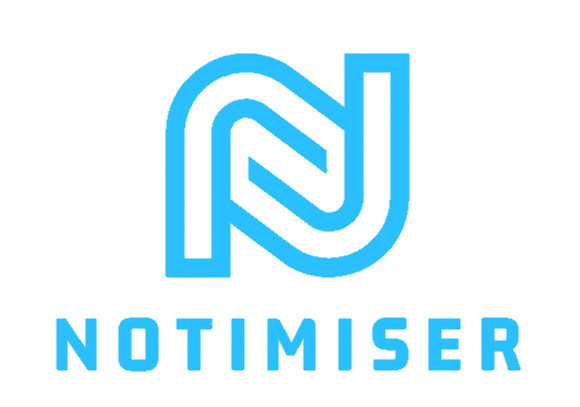

<a name="readme-top"></a>


<!-- PROJECT LOGO -->
<br />
<div align="center">
<!--   <a href="https://github.com/ahmedfahim21/Notimiser">
    
  </a> -->
<a href="https://imgtr.ee/i/8sf8q"></a>
<h3 align="center">NOTIMISER</h3>

  <p align="center">
    Notimiser is a web application that utilizes machine learning techniques to improve the user experience in summarizing academic and non-academic texts. The application offers the ability to upload images or pdf documents and generates a summarized version of the content, complemented with required images.
  </p>
</div>


<!-- ABOUT THE PROJECT -->
## Abstract Overview


To achieve the goal of differentiating between the modes of the text and summarizing it, Notimiser employs several machine learning models. The first model is used to segregate the type of text, which demands a separate workflow. The second model summarizes the text based on the mode. These models work together to create a summary that is dense in information and easy to understand.

Additionally, Notimiser utilizes the Wolfram plugins to a doubt clearing feature that complements the summarized text. This provides users with a more immersive and engaging experience, allowing them to better understand and retain the information provided.

In conclusion, Notimiser offers a unique and innovative solution for summarizing academic and non-academic texts, leveraging the power of machine learning and cutting-edge models to provide users with an efficient and engaging experience. With its ability to differentiate between text modes and provide summarized content with supporting images, Notimiser is poised to revolutionize the way people consume information.

## Project Snapshot

<!-- [![Product Name Screen Shot][product-screenshot]](https://example.com) -->
[](https://imgtr.ee/i/8sc5c)
## Solution

Notimiser uses the Summarizer Machine Learning Model, which helps in generating a summarized version of the text. The user input recieved by the frontend is in pdf, from which the text is extracted using certain python libraries. 

This text is sent as an input into various Machine Learning Models. The first model being the SBert Model for Summarization. 

## Summarisation Techniques

Notimiser uses extractive and abstractive summarisation techniques to generate a summary of the document. Extractive summarisation involves selecting important sentences from the original document and combining them to form a summary. 
Abstractive Summarisation will generate it's own summary. 
The choice of either is decided by our classification algorithm, where we decide to go with the former if the corpus is related to academia or the latter if not.

## Machine Learning Model

1) PDF Summarisation using Flask uses a Support Vector Machine (SVM) model for document classification. The model was trained on a dataset of labelled documents using scikit-learn. The following preprocessing steps were applied to the data:

2) Tokenization: splitting the text into individual words
Stopword removal: removing common words that do not provide useful information
Stemming: reducing words to their base form
The features used for classification were Sentence Transformer vectors. The SVM algorithm was chosen because it has been shown to perform well for text classification tasks.


<p align="right">(<a href="#readme-top">back to top</a>)</p>

## Usage/Examples

To use Notimiser, follow these steps:

Open the web application in your web browser.
Upload a PDF document using the provided form.
Click the "Notimise" button to receive a summary of the document.

### Built With


* [![React][React.js]][React-url]
* 
* 
* 
* 


<p align="right">(<a href="#readme-top">back to top</a>)</p>


<!-- GETTING STARTED -->
## Getting Started

This is an example of how you may give instructions on setting up your project locally.
To get a local copy up and running follow these simple example steps.


### Installation


1. Clone the repo
   ```sh
   git clone https://github.com/ahmedfahim21/Notimiser.git
   ```
2. Install and start frontend
   ```sh
   cd client
   npm install
   npm start
   ```
3. Install and start the backend
   ```sh
   cd server
   pipenv install --python 3
   pipenv shell
   pipenv install -r requirements.txt
   flask run
   ```

<p align="right">(<a href="#readme-top">back to top</a>)</p>


[product-screenshot]: https://i.ibb.co/m9fbxPT/Screenshot.png

[React.js]: https://img.shields.io/badge/React-20232A?style=for-the-badge&logo=react&logoColor=61DAFB
[React-url]: https://reactjs.org/


## Features

Notimiser offers several functionalities, one of them being the pdf to summarized text. User has an option to download the summarized version of the pdf according to convenience.


## Goal

Notimiser aims at resolving issues of students in better retention by providing visual aids and short summarised outputs. 

## Vision

- [ ] We plan to increase the scalability of this application, along with introducing the multifarious plug-ins offered by various AI organizations. 
- [ ] This can help alongside our summarization to better streamline the information to the user. 
- [ ] Our aim is also to make use of more Generative AI Models like Whisper, GPTs, DALL-E, Codex and many more to provide more support to the user.

## References
- https://nanonets.com/blog/pypdf2-library-working-with-pdf-files-in-python/#why-is-text-extraction-from-pdf-hard
- https://levelup.gitconnected.com/using-tensorflow-with-flask-and-react-ba52babe4bb5
- https://iq.opengenus.org/bert-for-text-summarization/#:~:text=Machine%20Learning%20(ML)%20BERT&text=Extractive%20Text%20summarization%20refers%20to,approach%20to%20perform%20NLP%20tasks.

<p align="right">(<a href="#readme-top">back to top</a>)</p>
